------


# rCompanion

Reticulum LXMF Client Display Companion for Lafvin ESP32-C6

**Un display companion per il tuo nodo Reticulum.**

rCompanion è un piccolo dispositivo basato su ESP32-C6 con display da 1.47" che mostra in tempo reale lo stato del tuo nodo [Reticulum](https://reticulum.network/) (RNS) in esecuzione su un PC o altra macchina server. Il C6 interroga via WiFi un REST sullo script server e visualizza 26 pagine di informazioni: stato della rete, traffico, messaggi LXMF, mappa dei nodi rmap.world, meteo, risorse di sistema, statistiche annunci, scanner WiFi/Bluetooth, uno screensaver animato e perfino 4 giochi.

Tutto è configurabile da una WebUI servita direttamente dal dispositivo.

Costruito su Lafvin ESP32-C6 , clone di waveshare esp32c6 (1.47" no touch), probabilmente usa gli stessi pin del Waveshare c6, facilmente adattabile per altri tipi di esp32.


---
<p align="center">
  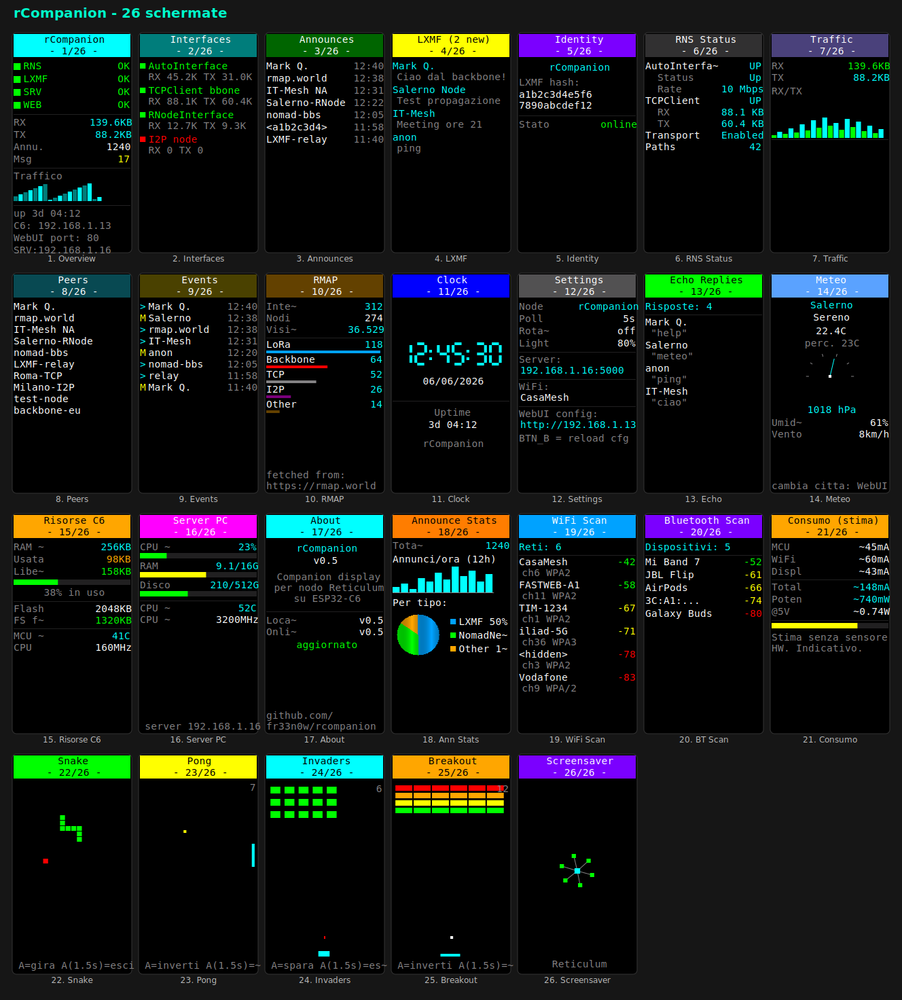
</p>

---

## Indice

- [Caratteristiche](#caratteristiche)
- [Hardware necessario](#hardware-necessario)
- [Architettura](#architettura)
- [Installazione](#installazione)
- [Quick Start](#quick-start)
- [Le schermate](#le-schermate)
- [WebUI e impostazioni](#webui-e-impostazioni)
- [Comandi del bot LXMF](#comandi-del-bot-lxmf)
- [I controlli fisici](#i-controlli-fisici)
- [Risoluzione problemi](#risoluzione-problemi)

---

## Caratteristiche

- **26 pagine** scorribili con un pulsante, ognuna con barra colorata e indicatore di pagina.
- **Stato del nodo in tempo reale**: RNS online, interfacce, annunci, messaggi LXMF, identità.
- **Grafici**: traffico RX/TX, annunci per ora con grafico a torta per tipo (LXMF / NomadNet / altro).
- **Integrazione rmap.world**: conteggio nodi, interfacce, visite al sito.
- **Meteo** con barometro analogico, città configurabile dalla WebUI.
- **Risorse**: RAM/flash/temperatura del C6 e CPU/RAM/disco del PC server.
- **Bot LXMF autoresponder**: risponde a comandi (`help`, `meteo`, `status`, `info`), echo automatico e risposte personalizzate.
- **Scanner WiFi e Bluetooth** integrati.
- **Stima del consumo elettrico**.
- **Screensaver animato** (robottino, logo RNS, campo stellare, testo).
- **4 giochi** a un pulsante: Snake, Pong, Space Invaders, Breakout.
- **LED RGB** che segue il colore della pagina o lo stato del nodo, con flash all'arrivo dei messaggi.
- **WebUI** completa per configurazione, toggle pagine, bot e riavvio remoto.
- **Controllo aggiornamenti** automatico da GitHub.

---

## Hardware necessario

- **Scheda ESP32-C6 con display ST7789 da 1.47"** (testato su LAFVIN / Waveshare ESP32-C6-LCD-1.47, pannello 172×320).
- **2 pulsanti** (molte schede li hanno già a bordo: BOOT + uno user).
- **LED RGB NeoPixel** (presente a bordo sulla maggior parte di queste schede).
- Un **PC** (Windows, Linux o macOS) sulla stessa rete WiFi, dove gira un nodo Reticulum.

### Mappatura pin (default)

| Funzione | GPIO |
|----------|------|
| Display SCL | 7 |
| Display SDA | 6 |
| Display RST | 21 |
| Display DC | 15 |
| Display CS | 14 |
| Display BLK (retroilluminazione) | 22 |
| LED RGB | 8 |
| Pulsante A (sinistro) | 9 |
| Pulsante B (destro) | 10 |

Se la tua scheda usa pin diversi, modificali in cima a `main.py`.

---

## Architettura

```
┌─────────────────────┐         WiFi / LAN          ┌──────────────────────┐
│   PC (Windows/Linux)│  ◄───── HTTP REST :5000 ───► │   ESP32-C6 + Display │
│                     │                              │                      │
│  rnsd (Reticulum)   │                              │  main.py (MicroPython)│
│  rcompanion_server  │                              │  - 26 pagine          │
│  - REST API         │                              │  - WebUI :80          │
│  - bot LXMF         │                              │  - polling ogni N sec │
│  - meteo, rmap, host│                              │                      │
└─────────────────────┘                              └──────────────────────┘
```

- Sul **PC** gira `rnsd` (l'istanza Reticulum) e, separatamente, `rcompanion_server.py`, che si aggancia all'istanza condivisa ed espone una REST API sulla porta 5000.
- Sul **C6** gira `main.py` (MicroPython), che interroga la REST API ogni N secondi e disegna le pagine. Il C6 serve anche una propria WebUI sulla porta 80 per la configurazione.

---

## Installazione

### 1. Lato PC (server)

Requisiti: Python 3.10+, un nodo Reticulum funzionante (`rns` installato e `rnsd` avviabile).

```bash
# Installa le dipendenze
pip install flask rns lxmf psutil

# Avvia il nodo Reticulum (se non è già attivo)
rnsd

# In un altro terminale, avvia il server rCompanion
python rcompanion_server.py
```

Il server stamperà l'indirizzo su cui è in ascolto (es. `http://0.0.0.0:5000`). Annota l'**indirizzo IP del PC** sulla rete locale (es. `192.168.1.xx`): ti servirà per configurare il C6.

> `psutil` serve per la pagina "Server PC". Senza, tutto il resto funziona ugualmente.

### 2. Lato ESP32-C6 (firmware)

1. **Flasha MicroPython** sulla scheda (v1.28.0 o superiore per ESP32-C6), ad esempio con l'[ESP Web Flasher](https://espressif.github.io/esptool-js/) o `esptool`.
2. Carica sul dispositivo, con [Thonny](https://thonny.org/) o `mpremote`, questi file:
   - `main.py` (il firmware rCompanion)
   - `st7789py.py` (driver display - [russhughes/st7789py_mpy](https://github.com/russhughes/st7789py_mpy))
   - `vga1_8x16.py` (font bitmap)
   - `microdot.py` (server WebUI - [microdot](https://github.com/miguelgrinberg/microdot))
3. Al primo avvio, se il WiFi non è configurato, collega il C6 al PC e modifica la configurazione (vedi Quick Start).

---

## Quick Start

1. Avvia `rnsd` e `rcompanion_server.py` sul PC.
2. Apri `main.py` in Thonny e, nella sezione `DEFAULT_CONFIG` in cima al file, imposta:
   ```python
   "wifi_ssid":   "LA_TUA_RETE",
   "wifi_pass":   "LA_TUA_PASSWORD",
   "server_ip":   "192.168.1.xx",   # IP del PC dove gira il server
   ```
3. Salva `main.py` sul dispositivo e riavvialo.
4. Alla partenza vedrai lo splash, poi l'IP ottenuto e la scritta **READY!**: parte la pagina Overview.
5. Da qui in poi puoi configurare tutto dalla **WebUI**: apri il browser su `http://<IP-del-C6>/` (l'IP del C6 è mostrato nella pagina Overview e nella pagina Settings).

Premi il **pulsante A** (sinistro) per scorrere le pagine.

---

## Le schermate

Le pagine si scorrono con il pulsante A. Ognuna ha un header colorato con il titolo, l'indicatore `pagina/totale`, uno spinner di attività in alto a sinistra e - se il carosello automatico è attivo - un pallino in alto a destra.

| # | Pagina | Cosa mostra |
|---|--------|-------------|
| 1 | **Overview** | Pannello di sintesi: stato RNS / LXMF / SRV (server) / WEB (webui), traffico, conteggi annunci e messaggi, mini-grafico traffico, uptime, IP del C6, porta WebUI e IP del server. |
| 2 | **Interfaces** | Le interfacce Reticulum attive con stato online/offline e byte RX/TX. |
| 3 | **Announces** | Ultimi annunci ricevuti sulla rete, con nome (se risolto) e orario. |
| 4 | **LXMF** | Inbox dei messaggi LXMF ricevuti, con nome mittente risolto. Il pulsante B segna come letti. |
| 5 | **Identity** | L'identità LXMF del nodo (hash). |
| 6 | **RNS Status** | Output di `rnstatus`: dettaglio interfacce, traffico, stato del transport. |
| 7 | **Traffic** | Grafico a barre RX/TX nel tempo, accumulato localmente dal C6. |
| 8 | **Peers** | Elenco dei peer noti con nome. |
| 9 | **Events** | Cronologia combinata di annunci (`>`) e messaggi (`M`) in ordine temporale. |
| 10 | **RMAP** | Dati da rmap.world: numero di interfacce, nodi unici, visite al sito, e barre colorate per tipo di nodo. |
| 11 | **Clock** | Orologio grande a cifre stile 7-segmenti, sincronizzato con l'ora locale del PC. |
| 12 | **Settings** | Riepilogo della configurazione corrente e indirizzo della WebUI. Il pulsante B ricarica la config. |
| 13 | **Echo** | Log delle risposte inviate dal bot autoresponder: a chi e cosa. |
| 14 | **Meteo** | Condizioni meteo della città scelta, con **barometro analogico**, temperatura, umidità e vento. |
| 15 | **Risorse C6** | RAM usata/libera, flash, temperatura interna e frequenza della CPU del dispositivo. |
| 16 | **Server PC** | CPU, RAM e disco del PC server (via psutil), con barre colorate. |
| 17 | **About** | Versione locale e online, avviso aggiornamenti, link al repository. |
| 18 | **Ann Stats** | Grafico a barre degli annunci per ora (ultime 12h) e grafico a torta per tipo (LXMF / NomadNet / altro). |
| 19 | **WiFi Scan** | Reti WiFi vicine con potenza del segnale (RSSI), canale e tipo di sicurezza. |
| 20 | **BT Scan** | Dispositivi Bluetooth LE rilevati con nome/indirizzo e potenza. |
| 21 | **Consumo** | Stima del consumo elettrico (MCU + WiFi + display) in mA/mW. |
| 22 | **Snake** | Gioco Snake classico. |
| 23 | **Pong** | Pong a parete. |
| 24 | **Invaders** | Space Invaders. |
| 25 | **Breakout** | Rompimattoni con pallina. |
| 26 | **Screensaver** | Animazioni che ruotano: robottino rimbalzante, logo RNS rotante, campo stellare, testo. |


## Schermate

<p align="center">
  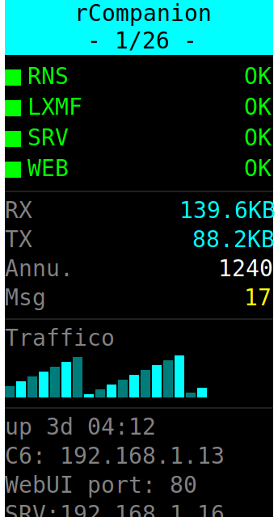
  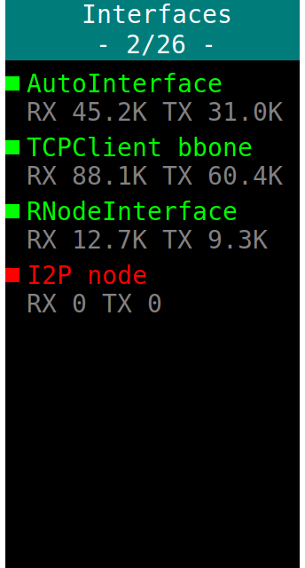
  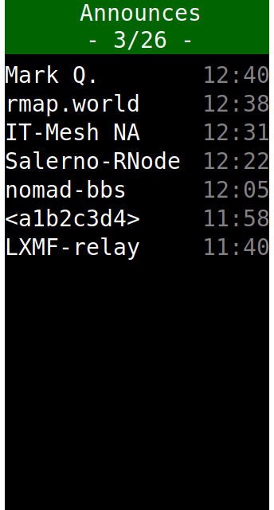
  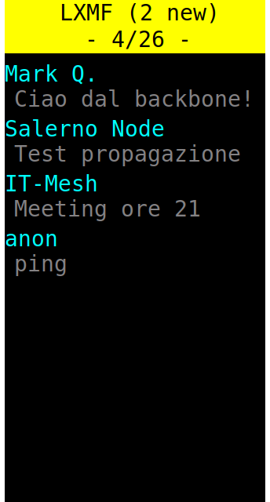
  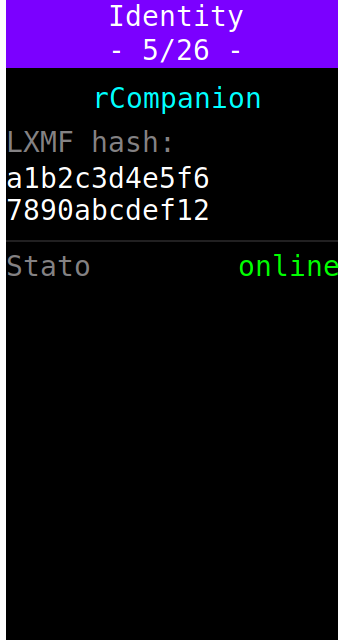
  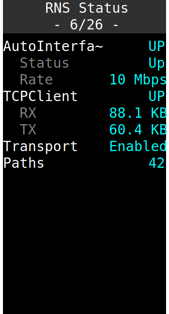
  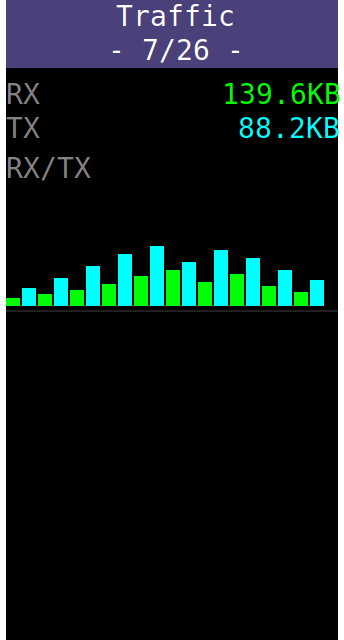
  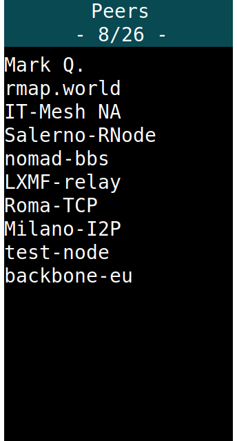
  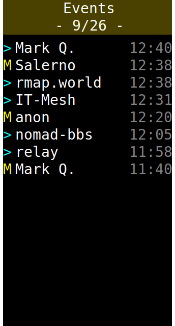
  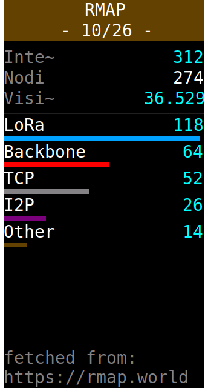
  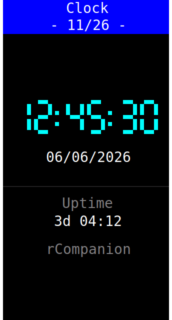
  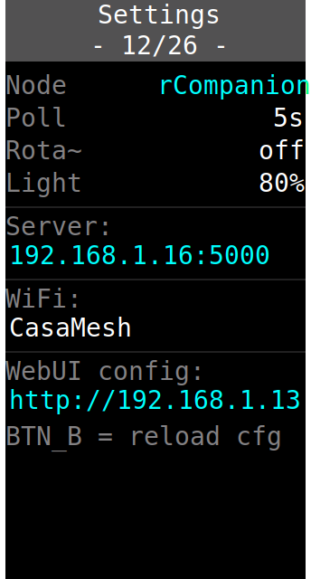
  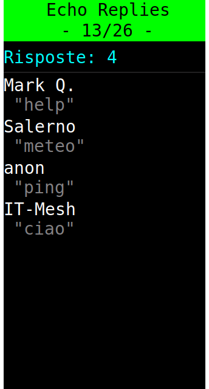
  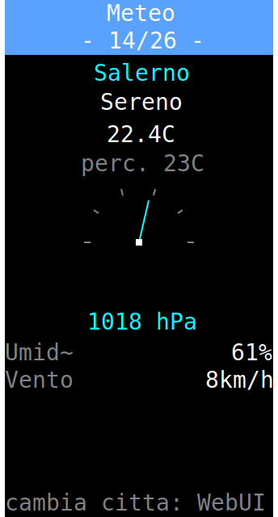
  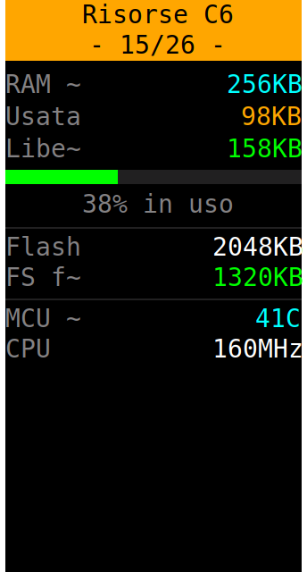
  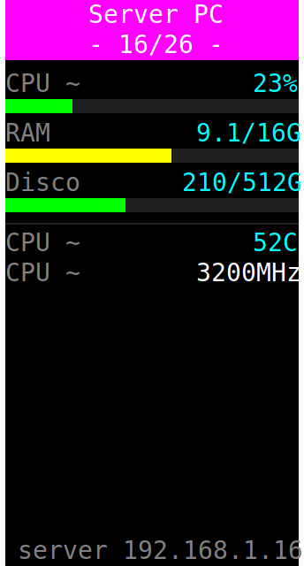
  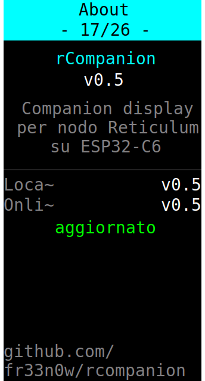
  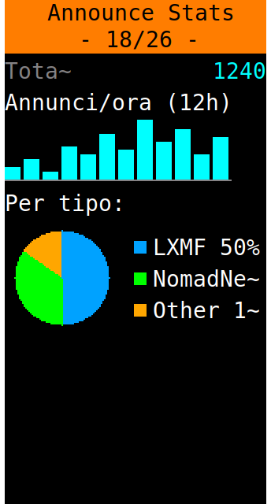
  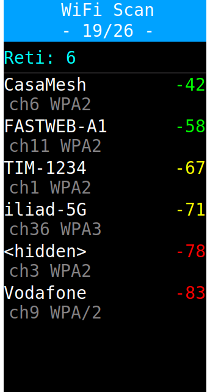
  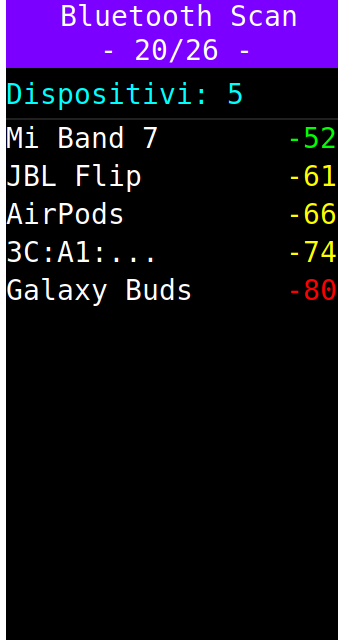
  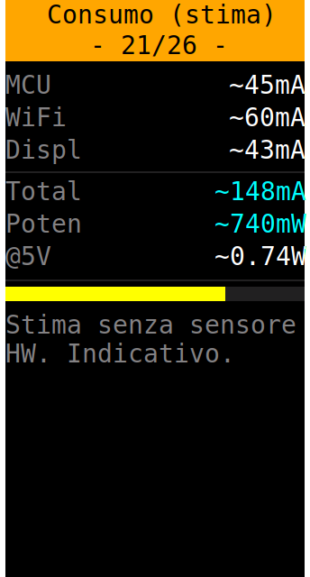
  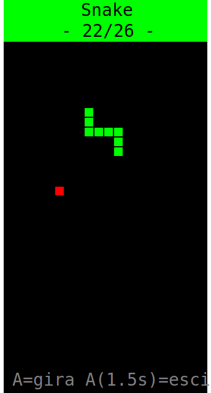
  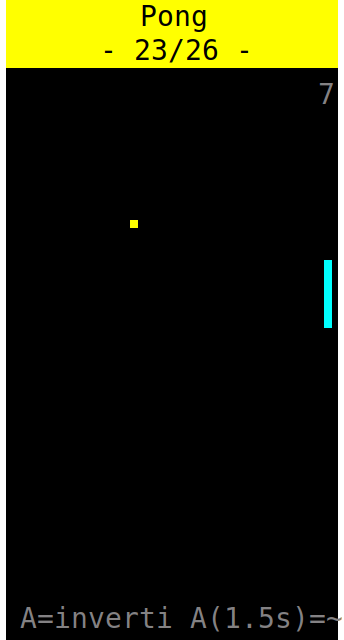
  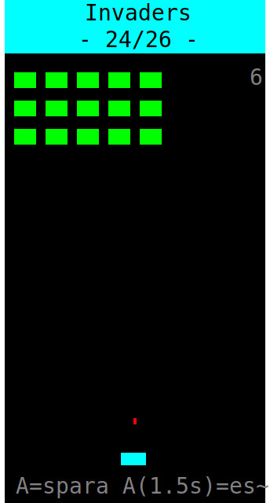
  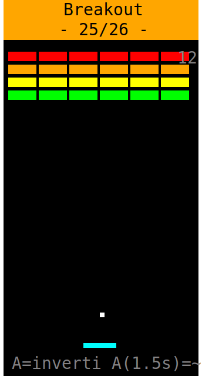
  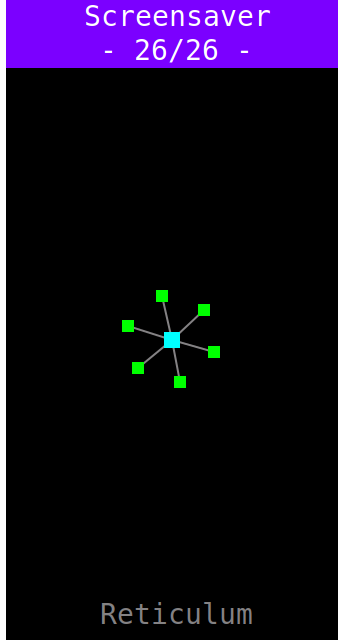
</p>

Nota: Gli screenshot sono generati in svg e potrebbero differire leggermente dalle schermate reali sul dispositivo, anche in base ad eventuali futuri aggiornamenti.  

---

## WebUI e impostazioni

Apri `http://<IP-del-C6>/` da qualsiasi dispositivo sulla stessa rete. Tutte le modifiche vengono applicate immediatamente e salvate; quelle del server (meteo, bot) persistono in un file sul PC, quelle del C6 nel suo `config.json`.

### Card Configurazione
- **Server IP / Porta** - indirizzo del PC dove gira `rcompanion_server.py`.
- **WiFi SSID / Password** - credenziali della rete (la password si inserisce solo per cambiarla).
- **Node name** - nome del dispositivo, mostrato in varie pagine.
- **Poll/refresh** - slider 1–30s: ogni quanto il C6 interroga il server.
- **Backlight %** - luminosità del display (controllo PWM).
- **Carosello auto** - slider 0–30s: se >0, le pagine scorrono automaticamente ogni N secondi (0 = disattivato).
- **LED segue colore pagina** - se attivo il LED assume il colore della pagina corrente; se disattivo indica lo stato (verde = ok, giallo = messaggi non letti, rosso = RNS offline, viola = interfaccia giù).

### Card Meteo
- **Città** - la città di cui mostrare il meteo nella pagina Meteo. Usa il geocoding di Open-Meteo (gratuito, senza API key). Default: Roma.

### Card Pagine attive
- Una checkbox per ognuna delle 26 pagine: spunta solo quelle che vuoi vedere scorrendo. Le pagine deselezionate vengono saltate (sia col pulsante che nel carosello). Almeno una deve restare attiva.

### Card Bot LXMF
- **Echo automatico** - il bot risponde a ogni messaggio rimandando il testo ricevuto.
- **Comandi** - attiva le risposte a `help`, `meteo`, `status`, `info`.
- **Risposte custom** - una per riga nel formato `parola = risposta`. Quando un messaggio contiene quella parola, il bot risponde con il testo indicato. Le parole custom compaiono anche nell'elenco del comando `help`.

### Salva tutto e Riavvia
- In fondo alla pagina, salva la configurazione e riavvia il C6.

La voce **Pagina** in cima alla WebUI si aggiorna in tempo reale e mostra quale schermata è visualizzata sul dispositivo in quel momento - utile quando il carosello è attivo.

---

## Comandi del bot LXMF

Inviando un messaggio LXMF al nodo, il bot può rispondere automaticamente (se abilitato dalla WebUI):

| Messaggio | Risposta |
|-----------|----------|
| `help` / `aiuto` / `?` | Elenco dei comandi disponibili (incluse le parole custom). |
| `meteo` / `weather` | Meteo attuale della città configurata. |
| `status` / `stato` | Stato del nodo: RNS, path, uptime. |
| `info` / `about` | Informazioni sul nodo. |
| *(parola custom)* | La risposta personalizzata impostata nella WebUI. |
| *(qualsiasi altro)* | Echo del messaggio, se l'echo è attivo. |

---

## I controlli fisici

### Navigazione normale
- **Pulsante A (sinistro)** - pagina successiva (salta le pagine disattivate).
- **Pulsante B (destro)** - azione contestuale della pagina (es. segna messaggi come letti, ricarica config).

### Nei giochi
Tutti e 4 i giochi si controllano con **un solo pulsante** (A):
- **Tap breve** = azione (gira / spara / inverti direzione, a seconda del gioco).
- **Tenuto premuto 1.5s** = esci dal gioco e torna a scorrere le pagine.
- Il pulsante B è disabilitato durante i giochi.

| Gioco | Tap breve |
|-------|-----------|
| Snake | Gira in senso orario |
| Pong | Inverti direzione della racchetta |
| Invaders | Spara |
| Breakout | Inverti direzione della racchetta |

---

## Risoluzione problemi

- **Il display resta nero / "Display FAIL"**: controlla la mappatura dei pin in cima a `main.py`; deve corrispondere alla tua scheda.
- **"WiFi FAIL"**: SSID o password errati nella config.
- **SRV rosso nella pagina Overview**: il C6 non raggiunge il server. Verifica che `rcompanion_server.py` sia in esecuzione, che l'IP nella config sia quello giusto e che PC e C6 siano sulla stessa rete.
- **L'orologio è sfasato**: l'ora viene presa dall'orologio di sistema del PC; assicurati che sia corretto.
- **Il bot non risponde ai client**: serve un *path* Reticulum verso il mittente. Al primo messaggio da un nodo nuovo possono volerci alcuni secondi perché il path si stabilisca; il server lo richiede e riprova automaticamente. Controlla nel terminale del server i log `Bot: consegnato a ...`.
- **La pagina Meteo non carica**: la prima lettura arriva dopo qualche secondo; verifica che il nome della città sia corretto.
- **psutil mancante**: la pagina "Server PC" lo segnala; installa con `pip install psutil`.

---

## Licenza
   
   Questo progetto è rilasciato sotto licenza [CC BY-NC 4.0](LICENSE):
   libero uso, modifica e condivisione con attribuzione, **uso commerciale vietato**.

## Crediti

- [Reticulum Network Stack](https://reticulum.network/) e [LXMF](https://github.com/markqvist/LXMF) di Mark Qvist.
- Driver display [st7789py_mpy](https://github.com/russhughes/st7789py_mpy) di Russ Hughes.
- WebUI con [Microdot](https://github.com/miguelgrinberg/microdot).
- Meteo via [Open-Meteo](https://open-meteo.com/).
- Mappa nodi: [rmap.world](https://rmap.world/).

